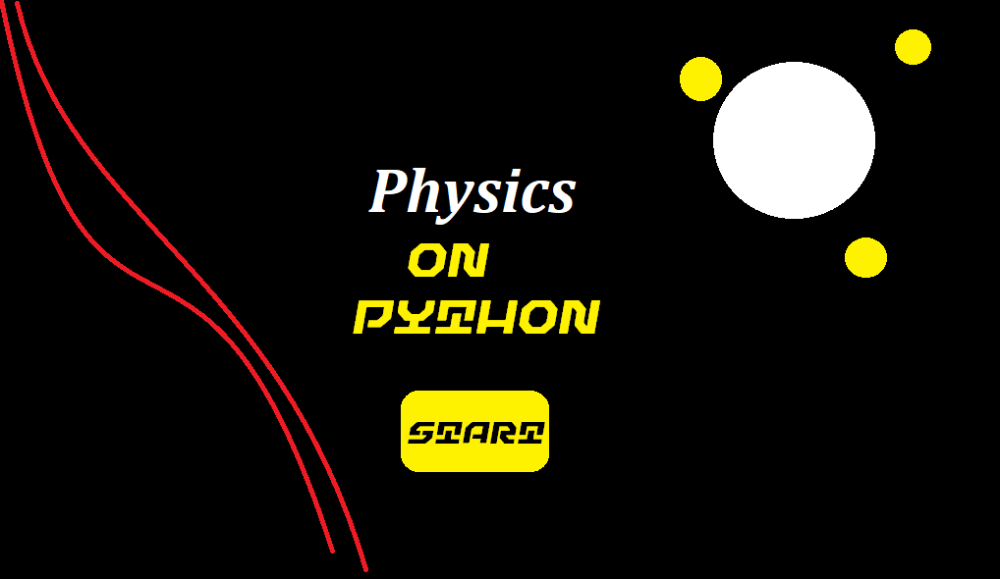
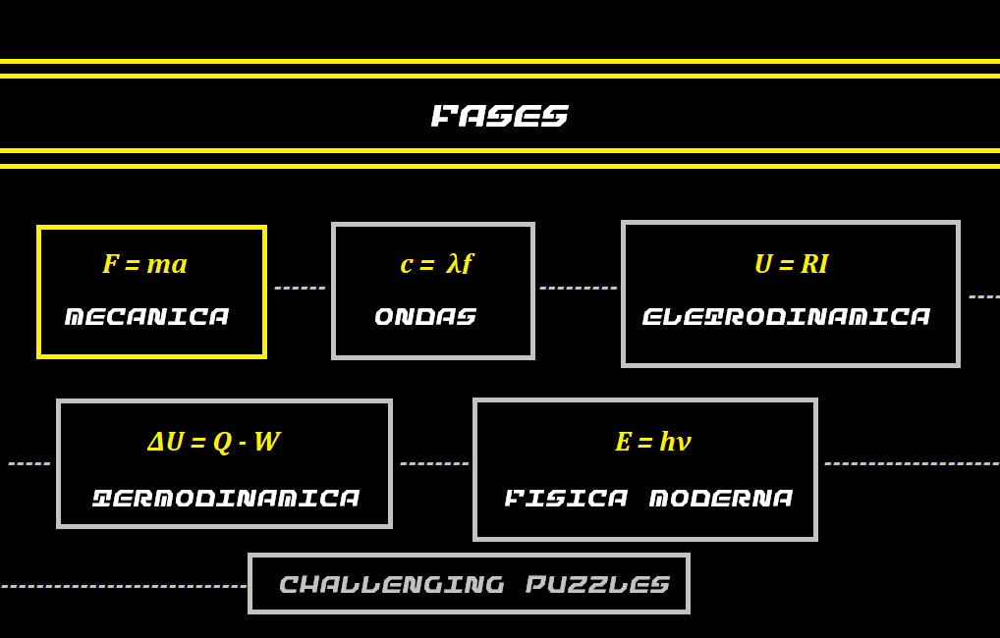

# PF_DesSoft_2019.1
"""
Alunos: 
	Cicero Tiago Carneiro Valentim;
	Luiz Felipe Lazzaron;
	Marcos Vinicius da Silva;

O projeto final de Design de Software se constitui na formação de um jogo, intitulado por “Phisics On Python”, sendo um game no estilo Puzzle. No jogo, o jogador precisa avançar por fases, as quais vão aumentando a dificuldade. À medida em que o jogo avança, a dificuldade vai aumentando, e as fases vão se tornando mais complexas.

ETAPAS DO PROJETO:
1. Pré-Projeto;
2. Pré-Produção;
3. Plano de Produção;
4. Produção;
5. Publicação;
6. Pós-Produção;

Pré-Projeto:
	CRONOGRAMA MACRO:
	>10/05 - Jogo simples rodando, com apenas uma fase teste;
	>17/05 - Jogo com iterações de fases novas e cenários;
	>24/05 - Jogo com todas as fases e os cenários definidos;
	>27/05 - Jogo pronto para entrega - Restante da semana com foco no visual;
	>31/06 - Entrega;

Pré-Produção:
	Elaboração do Game Design Document - 1 page GDD;
	Elaboração do Documento de Arte e Level Design;
	Elaboração do Documento de Som;

Plano de Produção
	Listar e ordenar tudo que for identificado e considerado necessário para o jogo - Adicionar no Trello;
	Planejamento dos ciclos de vida da produção - Semanal;
	Revisão do cronograma - Semanal;

Produção
	Reunião semanal de Planejamento;
	Relatório de bugs encontrados - Adicionar no GitHub;
	Reunião semanal com resultados das metas;
	Realização constante de testes - Toda sexta na aula de Design de Software;
	Ciclo de Polimento - Última semana, com o jogo pronto;

Publicação
	Ciclo Final - Polimento;
	Marketing - InsperX;
	Teste Final - Amigos/Colegas;
	Reunião final com a equipe;

Pós-Produção
	Documentação feedback dos usuários;
	Documento de Pós-Produção;
	Documentação Visual para portfólio de projetos - InsperX;
"""

#pagina inicial#

#menu de fases

#menu de fases#

#fase 0#

